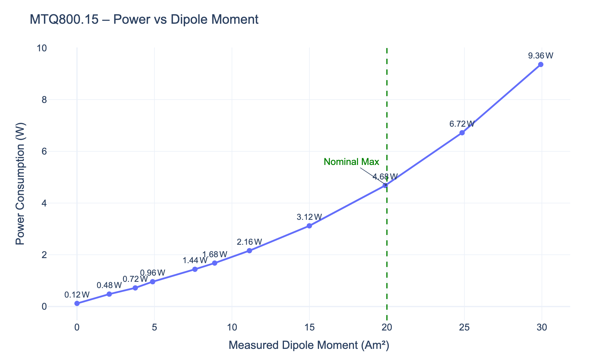

# magTorqReflect

A Python driver and test suite for the AAC Hyperion MTQ800.15 Magnetorquer, implementing the Hyperion Protocol for serial communication and providing comprehensive testing capabilities.

## Overview

This project provides a complete testing framework for the MTQ800.15 magnetorquer, including:

- **Full protocol implementation** for the Hyperion communication protocol
- **Comprehensive test suite** for device validation
- **Interactive power profiling** with automated data collection and visualization
- **Utility tools** for device discovery and debugging

## Features

### Core Driver ([`magtorquer/mtq_driver.py`](magtorquer/mtq_driver.py))

- **Protocol Support**: Complete implementation of Hyperion Protocol with CRC validation
- **Device Commands**: Full MTQ800.15 command set including temperature, dipole moment control, and mode management
- **Error Handling**: Robust communication error detection and recovery
- **Context Management**: Safe connection handling with automatic cleanup

### Test Suite

| Test | Description | File |
|------|-------------|------|
| **Connection Test** | Basic connectivity and device identification | [`test_01_connection_and_status.py`](tests/test_01_connection_and_status.py) |
| **Telemetry Test** | Temperature and dipole moment readings | [`test_02_get_telemetry.py`](tests/test_02_get_telemetry.py) |
| **Control Test** | Set/verify dipole moments and mode control | [`test_03_set_and_verify_dipole.py`](tests/test_03_set_and_verify_dipole.py) |
| **Power Profile** | Interactive power consumption characterization | [`test_interactive_power_profile.py`](tests/test_interactive_power_profile.py) |


## Installation

### Requirements

```bash
pip install -r requirements.txt
```

Required packages:
- `pyserial` - Serial communication
- `crc` - CRC calculation for protocol validation
- `plotly` - Power profile visualization (for interactive tests)

### Configuration

Update the device configuration in [`magtorquer/config_mtq.py`](magtorquer/config_mtq.py):

```python
SERIAL_PORT = "/dev/cu.usbserial-XXXX"  # Your device's serial port
BAUD_RATE = 115200
HOST_ADDRESS = 0x11    # Host controller address
MTQ_ADDRESS = 0x60     # MTQ device address
```

## Quick Start

### 1. Device Discovery

Find your MTQ device on the serial bus:

```bash
python scan_adresses.py /dev/cu.usbserial-XXXX
```

### 2. Basic Connectivity Test

Verify communication with the device:

```bash
python -m tests.test_01_connection_and_status
```

### 3. Device Control Test

Test dipole moment control and measurement:

```bash
python -m tests.test_03_set_and_verify_dipole
```

### 4. Power Profile Characterization

Run interactive power consumption testing:

```bash
python -m tests.test_interactive_power_profile
```

This will guide you through measuring power consumption at various dipole moments and generate both CSV data and an interactive plot.

## Usage Examples

### Basic Driver Usage

```python
from magtorquer.mtq_driver import MTQDriver
from magtorquer.config_mtq import *

# Context manager automatically handles connection/disconnection
with MTQDriver(SERIAL_PORT, BAUD_RATE, HOST_ADDRESS, MTQ_ADDRESS) as mtq:
    # Check device status
    status = mtq.get_status()
    
    # Read temperature
    temp = mtq.get_temperature()
    print(f"Temperature: {temp:.1f}°C")
    
    # Set dipole moment and start
    mtq.set_dipole_moment(5000.0)  # 5000 mAm²
    mtq.start()
    
    # Read back measured moment
    measured = mtq.get_dipole_moment()
    print(f"Measured: {measured} mAm²")
    
    # Safe shutdown
    mtq.set_dipole_moment(0.0)
    mtq.stop()
```

### Power Profile Analysis

The interactive power profile test generates comprehensive data:



- **CSV Export**: Raw measurement data saved with timestamps
- **Interactive Plots**: Plotly-generated charts with hover details
- **Saturation Detection**: Automatic identification of dipole saturation
- **Safety Limits**: Visual indicators for recommended operating ranges

## Project Structure

```
magTorqReflect/
├── magtorquer/           # Core driver package
│   ├── mtq_driver.py     # Main MTQ driver class
│   ├── config_mtq.py     # Device configuration
│   └── logging_config.py # Logging setup
├── tests/                # Test suite
│   ├── test_01_*.py      # Connection tests
│   ├── test_02_*.py      # Telemetry tests
│   ├── test_03_*.py      # Control tests
│   └── test_interactive_*.py # Power profiling
├── data/                 # Test results and plots
├── scan_adresses.py      # Device discovery utility
└── serial_console.py     # Debug console
```

## Protocol Details

The driver implements the complete Hyperion Protocol specification:

- **Frame Format**: `$<HOST><NODE><CMD><LEN><DATA>:<CRC>\n`
- **CRC**: 8-bit polynomial 0xEB with no reflection
- **Addressing**: 8-bit host and node addresses
- **Commands**: Both general Hyperion and MTQ-specific commands

### Supported Commands

| Command | ID | Description |
|---------|----| ------------|
| `WHO_AM_I` | 0x10 | Device identification |
| `GET_TEMPERATURE` | 0x20 | On-chip temperature reading |
| `GET_DIPOLE_MOMENT` | 0x21 | Current dipole moment |
| `SET_DIPOLE_MOMENT_SETPOINT` | 0x22 | Set target dipole moment |
| `START/STOP` | 0x25/0x26 | Device mode control |
| `GET_STATUS` | 0x34 | Device status check |

## Safety Features

- **Automatic Shutdown**: Context manager ensures safe disconnection
- **Range Validation**: Dipole moment limits enforced (±30,000 mAm²)
- **Watchdog Support**: Background ping thread for long operations
- **Error Recovery**: Comprehensive exception handling

## Testing Results

Recent power characterization results show:

- **Idle Power**: 0.12W at 0 mAm²
- **Linear Region**: Up to ~15 Am² (15,000 mAm²)
- **Boost Region**: Above 20 Am² with increased power consumption
- **Maximum Test**: 9.36W at 30 Am²

## Contributing

1. Follow the existing code style and structure
2. Add tests for new functionality
3. Update documentation for any API changes
4. Ensure all tests pass before submitting

## License

MIT License - see [`LICENSE`](LICENSE) for details.

## Hardware Compatibility

- **Device**: AAC Hyperion MTQ800.15 Magnetorquer
- **Protocol**: Hyperion Protocol over RS-232/USB-Serial
- **Baud Rate**: 115200 bps (configurable)
- **Dipole Range**: ±30,000 mAm² (±30 Am²)